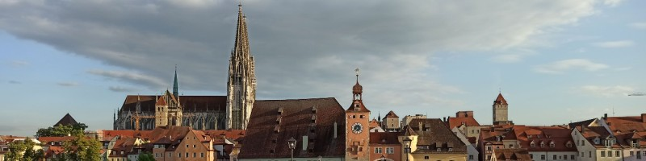

# Hi there - I'm Marten Scheuck
I am a PhD student in astronomy working at the [Max-Planck Institute for Astronomy](https://www.mpia.de/de) in Heidelberg, Germany.  I am aspiring to become a full fledged researcher in astronomy with the wish of combining both programming and observation to contribute to the exploration of our universe and the scientific advance.

Before that my Alma Mater has been the University of Regensburg, where, in its beautiful city I lived for 6 years

At the moment I am working on improving my Python as well as C++ skills and aquiring general knowledge about clean and productive code to improve my abilities in general, but even more so to further my ability to do astronomical computation.

## Some General Stuff
* My work so far: 
&nbsp;&nbsp;&nbsp;&nbsp;&nbsp;&nbsp;&nbsp;&nbsp;&nbsp;&nbsp; [Publications](https://www.researchgate.net/profile/Marten-Scheuck-2) 

* How to reach me:
&nbsp;&nbsp;&nbsp;&nbsp;&nbsp;&nbsp;&nbsp;&nbsp;&nbsp;&nbsp; [Email](martenscheuck@gmail.com)
&nbsp;&nbsp;&nbsp;&nbsp;&nbsp;&nbsp;&nbsp;&nbsp;&nbsp;&nbsp; [Twitter](https://twitter.com/MartenScheuck)
&nbsp;&nbsp;&nbsp;&nbsp;&nbsp;&nbsp;&nbsp;&nbsp;&nbsp;&nbsp; [LinkedIn](https://www.linkedin.com/in/marten-scheuck/)
